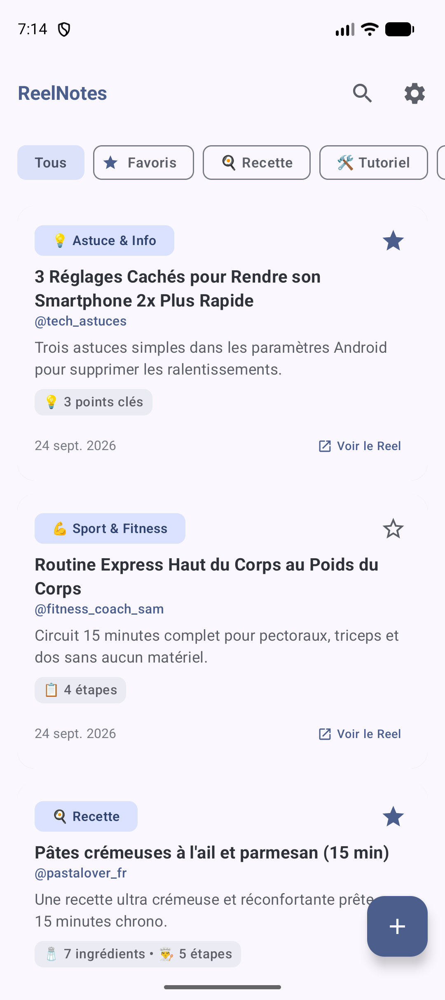
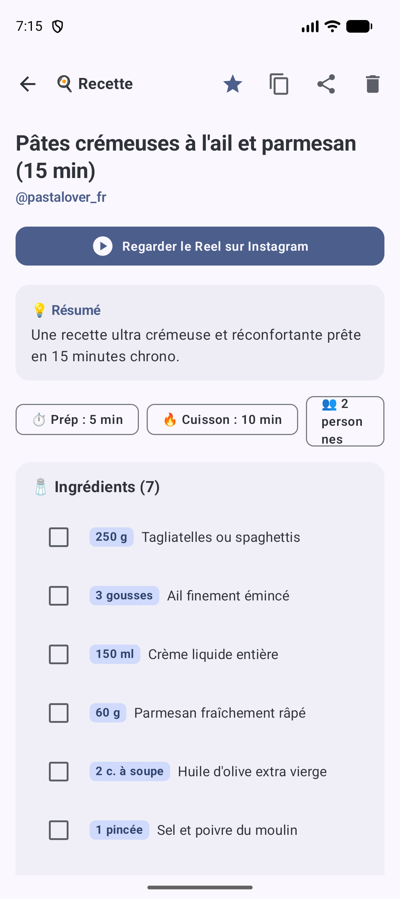
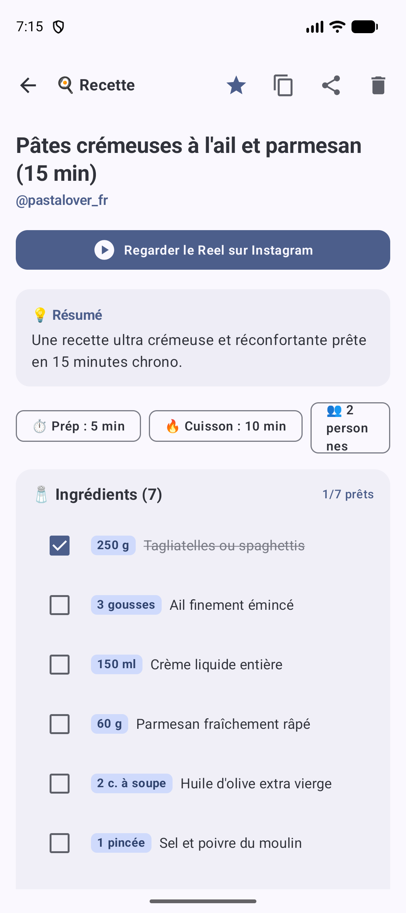

# 📱 ReelNotes - Transformez vos Reels Instagram en Notes Structurées

**ReelNotes** est une application Android moderne développée en **Kotlin** et **Jetpack Compose (Material 3)**. Elle permet de capturer n'importe quel Reel Instagram partagé depuis l'application officielle, d'en extraire le contenu et de le synthétiser automatiquement sous forme de fiches pratiques (recettes de cuisine avec liste d'ingrédients à cocher, routines sportives, tutoriels, astuces, etc.) sauvegardées localement.

<p align="center">
  
  &nbsp;&nbsp;&nbsp;&nbsp;
  
  &nbsp;&nbsp;&nbsp;&nbsp;
  
</p>

---

## 🌟 Fonctionnalités Principales

### 1. 📲 Partage direct depuis Instagram (Android Share Target)
- Vous naviguez sur Instagram et trouvez un Reel intéressant (recette, entraînement, astuce bricolage, tech...).
- Appuyez sur **Partager** > Sélectionnez **ReelNotes**.
- L'application s'ouvre, nettoie les paramètres de tracking (`?igsh=...`), télécharge les métadonnées et la légende, structure le contenu et enregistre la note automatiquement.

### 2. 🧠 Double Moteur d'Extraction & Structuration
- **Mode Hors-Ligne Autonome (NLP heuristique) :** Fonctionne à 100% sans connexion et **sans aucune clé API**. Analyse intelligemment les lignes de texte, repère les quantités (`250g`, `3 c. à soupe`, `150ml`), les unités, les étapes numérotées, les emojis et hashtags.
- **Mode IA Google Gemini (Optionnel) :** En renseignant une clé API Google Gemini gratuite dans les Paramètres, l'application utilise l'IA multimodale `gemini-2.0-flash` pour générer un résumé de haute précision avec temps de préparation, temps de cuisson, portions et astuces de chef.

### 3. 🍳 Fiches Interactives & Pratiques
- **Checklist d'ingrédients interactive :** Cochez vos ingrédients en temps réel au supermarché ou devant vos fourneaux !
- **Suivi des étapes :** Cochez les étapes de préparation ou les exercices réalisés.
- **Lien direct vers le Reel :** Un bouton dédié permet d'ouvrir le Reel original directement dans Instagram ou dans le navigateur en un tap.
- **Export & Partage :** 
  - Copie propre en **Markdown** dans le presse-papier.
  - Partage de la note vers WhatsApp, Google Keep, Notes, SMS, Email, etc.

### 4. 🗂️ Organisation, Recherche & Favoris
- **Filtres par Catégories :** Recettes 🍳, Tutoriels 🛠️, Sport & Fitness 💪, Astuces & Info 💡, Voyage ✈️, Produits 🛍️, Général 📝.
- **Recherche temps réel :** Recherchez instantanément par titre, mot-clé, ingrédient, tag (`#pasta`) ou créateur (`@chefnico`).
- **Gestion des Favoris :** Marquez vos Reels favoris avec l'étoile.
- **Ajout manuel (+) :** Collez un lien ou le texte partagé d'un clic grâce au bouton dédié au presse-papier.

---

## 🏗️ Architecture & Choix Techniques

Le projet respecte les principes de la **Clean Architecture** et du patron **MVVM (Model-View-ViewModel)** recommandé par Google :

```
reelnotes/
├── app/
│   ├── src/
│   │   ├── main/
│   │   │   ├── AndroidManifest.xml              # Déclaration Intent Filter ACTION_SEND
│   │   │   ├── java/com/danstudios/reelnotes/
│   │   │   │   ├── ReelNotesApp.kt              # Initialisation DB & Sample data
│   │   │   │   ├── MainActivity.kt              # Point d'entrée & gestion des Intents de partage
│   │   │   │   ├── data/
│   │   │   │   │   ├── local/
│   │   │   │   │   │   ├── AppDatabase.kt       # Base de données Room SQLite
│   │   │   │   │   │   ├── ReelNoteDao.kt       # Requêtes Flow réactives
│   │   │   │   │   │   ├── ReelNoteEntity.kt    # Entité Room & Mappings
│   │   │   │   │   │   └── PreferencesManager.kt# Stockage clé API Gemini & réglages
│   │   │   │   │   ├── network/
│   │   │   │   │   │   ├── InstagramMetadataFetcher.kt # Extraction métadonnées & embed
│   │   │   │   │   │   └── GeminiSummarizer.kt         # Client REST Gemini 2.0 Flash
│   │   │   │   │   ├── repository/
│   │   │   │   │   │   └── ReelNoteRepository.kt       # Repository unique Room/Network
│   │   │   │   │   └── util/
│   │   │   │   │       └── SampleDataProvider.kt       # Exemples réalistes (recette, sport, astuce)
│   │   │   │   ├── domain/
│   │   │   │   │   ├── model/
│   │   │   │   │   │   ├── NoteCategory.kt         # Enum catégories avec émojis
│   │   │   │   │   │   ├── StructuredNoteData.kt   # Ingrédients, étapes, points clés
│   │   │   │   │   │   └── ReelNote.kt             # Modèle métier complet
│   │   │   │   │   ├── extractor/
│   │   │   │   │   │   ├── OfflineHeuristicExtractor.kt # Analyseur NLP regex/heuristique
│   │   │   │   │   │   └── ReelExtractionPipeline.kt   # Pipeline d'orchestration
│   │   │   │   │   └── util/
│   │   │   │   │       └── UrlParser.kt            # Extraction d'URL & shortcode Instagram
│   │   │   │   └── ui/
│   │   │   │       ├── components/
│   │   │   │       │   ├── NoteCard.kt             # Carte avec stats & badges
│   │   │   │       │   ├── CategoryChipRow.kt      # Carrousel horizontal de filtres
│   │   │   │       │   ├── RecipeChecklist.kt      # Checklist interactive d'ingrédients
│   │   │   │       │   ├── StepList.kt             # Liste d'étapes numérotées
│   │   │   │       │   ├── AddReelDialog.kt        # Boîte de dialogue d'ajout manuel
│   │   │   │       │   └── ProcessingOverlay.kt    # Indicateur de chargement
│   │   │   │       ├── navigation/
│   │   │   │       │   └── Screen.kt               # Routes Compose Navigation
│   │   │   │       ├── screens/
│   │   │   │       │   ├── NotesListScreen.kt      # Liste principale, recherche & filtres
│   │   │   │       │   ├── NoteDetailScreen.kt     # Fiche détaillée & actions
│   │   │   │       │   └── SettingsScreen.kt       # Configuration Gemini & langue
│   │   │   │       ├── theme/
│   │   │   │       │   ├── Color.kt, Type.kt, Theme.kt # Material You dynamic colors
│   │   │   │       └── viewmodel/
│   │   │   │           └── ReelNotesViewModel.kt   # StateFlow, actions réactives
│   │   └── test/                                   # Suite complète de tests unitaires
```

### Stack Technologique
- **Langage :** Kotlin 2.1
- **UI :** Jetpack Compose + Material Design 3
- **Base de données :** AndroidX Room 2.6 (SQLite avec flux réactifs `Flow`)
- **Réseau & JSON :** OkHttp 4.12 + Kotlinx Serialization
- **IA :** Google Gemini Flash REST API (2.0 / 1.5)
- **Navigation :** AndroidX Navigation Compose
- **Target Android :** Android 15 (SDK 35), compatible dès Android 8.0 (SDK 26)

---

## 🚀 Installation & Lancement

### 1. Fichier APK déjà compilé
L'APK debug prêt à l'installation est disponible directement dans le répertoire :
```bash
app/build/outputs/apk/debug/app-debug.apk
```

Pour l'installer directement sur votre smartphone Android branché en USB ou sur un émulateur :
```bash
adb install -r app/build/outputs/apk/debug/app-debug.apk
```

### 2. Compiler le projet
Le wrapper Gradle embarque l'environnement requis :
```bash
# Lancer les tests unitaires
./gradlew testDebugUnitTest

# Générer l'APK de debug
./gradlew assembleDebug
```

---

## 📖 Guide d'Utilisation

1. **Lancement initial :** À la première ouverture, des exemples réalistes sont chargés automatiquement (une recette de pâtes crémeuses à l'ail et parmesan, une routine fitness sans matériel, et une astuce tech pour Android).
2. **Depuis Instagram :** 
   - Cliquez sur l'icône de partage sous n'importe quel Reel.
   - Touchez **Partager via...** puis l'icône **ReelNotes**.
   - La note est générée et s'affiche immédiatement.
3. **Ajout manuel :**
   - Cliquez sur le bouton flottant **+** en bas à droite de l'écran d'accueil.
   - Collez le lien ou touchez l'icône du presse-papier.
   - Cliquez sur **Transformer en notes**.
4. **En cuisine :**
   - Ouvrez votre recette.
   - Cochez les ingrédients préparés au fur et à mesure !
   - Utilisez le bouton **Regarder le Reel sur Instagram** si vous avez besoin de revoir un geste technique en vidéo.
5. **Configuration IA (Facultatif) :**
   - Rendez-vous dans **Paramètres** (icône roue crantée en haut à droite).
   - Renseignez votre clé Google Gemini (obtenue gratuitement sur [Google AI Studio](https://aistudio.google.com/)).
   - Choisissez votre langue préférée pour les synthèses.

---

## 🧪 Tests Unitaires

Une suite complète de tests unitaires valide le bon fonctionnement de tous les modules :
- `UrlParserTest` : Validation des différents formats de liens Instagram Reel (`/reel/`, `/p/`, `/reels/`, `instagr.am`), extraction du shortcode, nettoyage des paramètres de tracking (`?igsh=...`).
- `OfflineHeuristicExtractorTest` : Détection et parsing des recettes en français et anglais (quantités, unités, étapes, tags), détection des catégories workout et astuces.
- `GeminiResponseParserTest` : Validation du désérialiseur JSON structuré et extraction des blocs markdown.
- `ReelNoteMappingTest` : Vérification des conversions bidirectionnelles entre modèles métier et entités Room.
